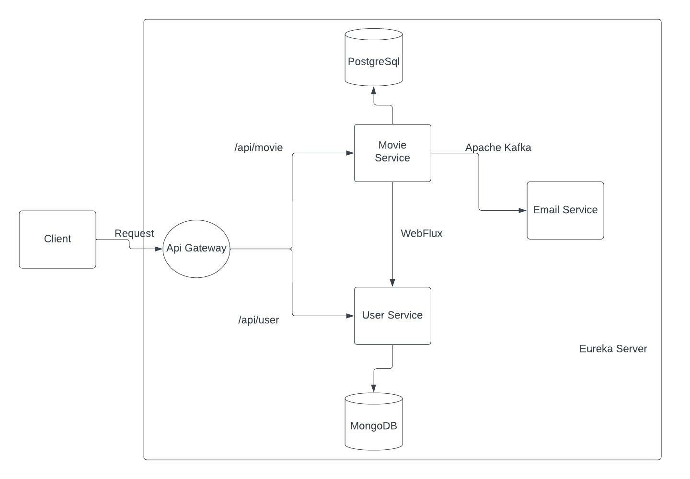
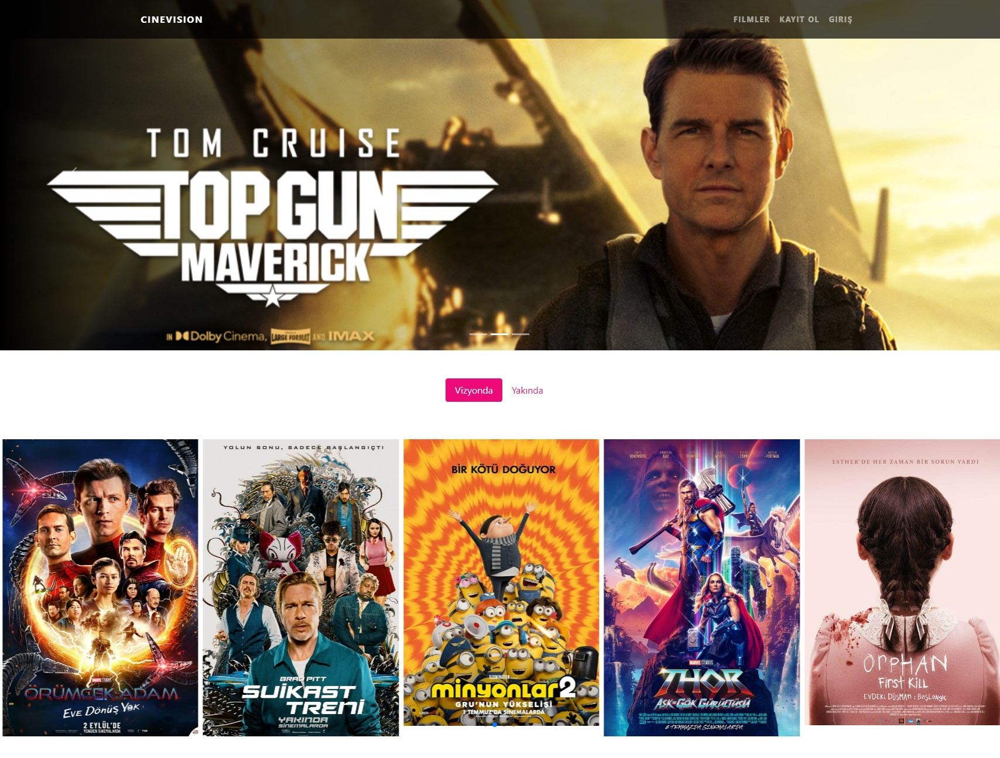

# Full Stack Web Project with Microservices
This project is a full-stack web application project
and it was created with Java and React. 
Spring Cloud was used in this project to create
the microservice architecture. Detailed explanations
of the services in the microservice architecture 
are explained in the readme files of the services.

## Subject Of Project
CineVision App is online cinema ticket sale website. Purpose of 
this website is to provide ease of buying tickets for those who 
want to watch movies in the cinema. People can display movies in the theaters or
upcoming movies. They can view the movie details and can learn the plot of the movie, 
actors of the movie, release date and so on. In this detail page, people can choose the city
and movie theater where they want to watch to movie. After this selection, they can automatically
redirect to payment page. In this payment page, they can choose ticket count and type such as 
student and adult. Then, they can choose the chairs they will sit on in the movie theater.
Finally, they complete the payment process after entering information
such as credit card information, email, name and surname.
If the payment is successful, the ticket details are sent to the email which entered by the user.
If people want to share their opinions about the movie, they can write comments on the movie detail page.
However, People must create an account to comments on movies. Only admins
can add movie,actor or director to the system. This authorization process is controlled
with Jwt token.

## Technologies Of Project
There are many technologies in this project. These are:
<h5> Backend Techologies </h5>
<ul>
    <li>Java 17</li>
    <li>Spring Boot 2.7.0 </li>
    <li>Spring Cloud</li>
    <li>Spring Data Jpa</li>
    <li>Spring Security</li>
    <li>Lombok</li>
    <li>WebClient</li>
    <li>Apache Kafka</li>
    <li>Jwt</li>
    <li>Java Mail Sender</li>
    <li>Zipkin</li>
    <li>Resilience4j</li>
    <li>PostgreSql</li>
    <li>MongoDB</li>
    <li>Redis</li>
    <li>Docker</li>
</ul>
<h5> Frontend Techologies </h5>
<ul>
    <li>JavaScript</li>
    <li>React</li>
    <li>Bootstrap</li>
    <li>Redux</li>
</ul>

## Usage Of Technologies In Project
There are 5 services in this project and each service 
are written with N-layered architecture. Spring Cloud
used for microservice infrastructure.
Netflix Eureka Server used to create eureka server. This 
eureka server contains movie service, user service and email service
eureka clients and api-gateway service. In addition,
Zipkin and Sleuth were used to monitor cross-service logs. Also,
Resilience4j used as Circuit Breaker.
 
 
In the Api Gateway, Spring Cloud Gateway was used for managing
requests.
 
 
In the Eureka Server, Netflix Eureka Server was used. And Spring
Security was used to secure eureka server.
 
 
WebFlux was used for communication between Movie and User Services.
And, Apache Kafka was used for asynchronous communication
between Movie and Email Services.
 
 
In the User Service, MongoDB used as database. Spring Security
was used for encrypting user's passwords and generating Jwt token.
 
 
In the Movie Service, PostgreSql used as database and Spring Data Jpa
was used. Webflux and Apache Kafka was used for communication with other services.
Resilience4J Circuit Breaker was used here. Displaying and coming soon movies
are cached using with Redis.
 
 
In the Email Service, Apache Kafka was used for receiving the 
message from Movie Service. Java Mail Sender and FreeMarker template 
was used for creating email template and sending email.
 
 
PostgreSql, MongoDB, Apache Kafka and Zipkin run as Docker container
in the docker-compose.yml file.

On the Frontend side, JavaScript and React was used. Also,
Axios was preferred to send request to the backend. For state management,
Redux was used. For, design of the UI, Bootstrap and Css are used.

## Architectural Design

    

## How can I use the Project ?
Download the source code of project. Open this project with your 
favorite IDE. Make sure Java 17, Node.js and Docker are installed on
your computer. And, follow these steps:

<ol>
    <h3> <li>Run docker-compose.yml file</li> </h3>

This docker compose file is necessary to run postgre, mongo, 
kafka etc. Open cmd in the project directory and type

    docker compose up -d

command to run the containers.

 <h3> <li>Run Eureka Server</li> </h3>

    Go to EurekaServerApplication class which is in eureka-server module
and run this class to create eureka server. If you want to display
eureka server panel, you can go to <b>localhost:8080/eureka/web </b> or
<b>localhost:8761</b> addresses. Then, enter username= <b>eureka</b> and 
password= <b>password</b>.

 <h3> <li>Run Api Gateway</li> </h3>

   To forward the requests to the relevant services, Gateway must be 
run. Go to ApiGatewayApplication class which is in api-gateway modules
and run this class. If you want to check that the api-gateway is registered 
to the eureka server, you can display the eureka server panel.

 <h3> <li>Run Movie Service</li> </h3>

 
To run movie service go to movie service module. And, run 
MovieServiceApplication class.

<h3> <li>Run User Service</li> </h3>

 
In the user service module, find UserServiceApplication class and run this
class.

<h3> <li>Run Email Service</li> </h3>

 
EmailServiceApplication class is in email service module. To run email service module,
run this class.

<h3> <li>Run Email Service</li> </h3>

 
EmailServiceApplication class is in email service module. To run email service module,
run this class. If this module is started successfully, you can view 
all running services in the eureka server using with eureka panel which is
running on localhost:8761 or localhost:8080/eureka/web.

<h5>Important Note:  
Change mail configurations in application.yml file with your own configurations.
</h5>

<h3> <li>Start React (Frontend) Application</li> </h3>

 
Go to frontend package which is the location of frontend code.
Firstly, type

    npm install

command in cmd for downloading package.json dependencies. Then, To start
the React app, type

    npm start

command. After that, npm will start your React Application
on <b> localhost:3000 </b>.

</ol>

## Project UI

https://user-images.githubusercontent.com/79381882/194945895-f7e2d2d2-4899-4ade-8c79-ecb647949ffd.mp4

<h4>Main Page</h4>

[For more UI Images](https://github.com/VonHumbolt/CineVisionMicroserviceProject/tree/main/frontend)
