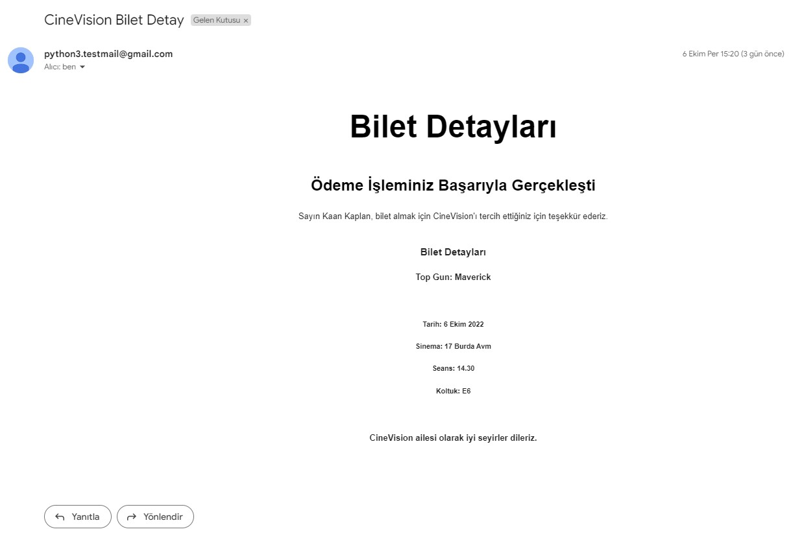

# Email Service
The task of Email Service is receiving message which will sent to an email
from Kafka Topic using Kafka Consumer. After this message is taken,
mail template is created with Freemarker and email is send with Java Mail Sender.

## Technologies
<ul>
    <li>Spring Cloud Netflix Eureka Client</li>
    <li>Spring Web</li>
    <li>Apache Kafka</li>
    <li>Java Mail Sender</li>
    <li>Freemarker Template</li>
    <li>Zipkin</li>
    <li>Sleuth</li>
</ul>

## Layers Of User Service
<ol>
    <h3><li>Dto</li></h3>
    

        EmailMessageKafkaDto class is in this package. KafkaConsumer
deserialize Json object to this class. For this, json type is defined in
application.yml file.
    

<h3><li>Kafka</li></h3>
    

        KafkaConsumer is created in here. This class receive message from 
Kafka Topic and deserialize to EmailMessageKafkaDto class.
    

<h3><li>Config</li></h3>
    

        FreeMarkerEmailTemplateConfig configuration class is in package.
In this class, we define the path of Email Template file.
    

<h3><li>Business</li></h3>
    

        Sending email message process is in this package's class.
Java Mail Sender sends email in EmailServiceImpl class.
    

</ol>

## Resources Directory

 Email Template file which is emailTemplate.ftlh is here. Email is sent 
with this template.
 
    Eureka Client, Kafka Consumer, Zipkin, Sleuth and Mail
properties in application.yml file. 

<h3>
Important Reminder   
If you want to use this source code, you must change the
mail settings in application.yml to your own.
</h3>

## Image of Sent Email
