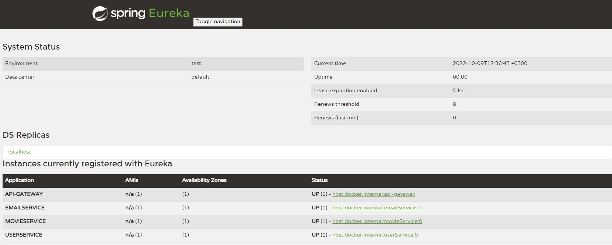

# Eureka Server
Spring Cloud Netflix Eureka Server was used to create eureka server. All services
in the microservices was registered in this eureka server. 
For securing eureka server, Spring security basic authentication was used.

## Technologies
<ul>
    <li>Spring Cloud Netflix Eureka Server</li>
    <li>Spring Security</li>
    <li>Zipkin</li>
    <li>Sleuth</li>
</ul>

## Packages and Files Of Eureka Server
<ol>
    <h3><li>Config Package</li></h3>
    

        SecurityConfig class is in this package. Eureka server was secured 
this security configurations. 
    

<h3><li>application.yml File</li></h3>
    

        Eureka Server properties, port and zipkin and sleuth properties are 
in this file.
    

</ol>

## Eureka Server Panel

