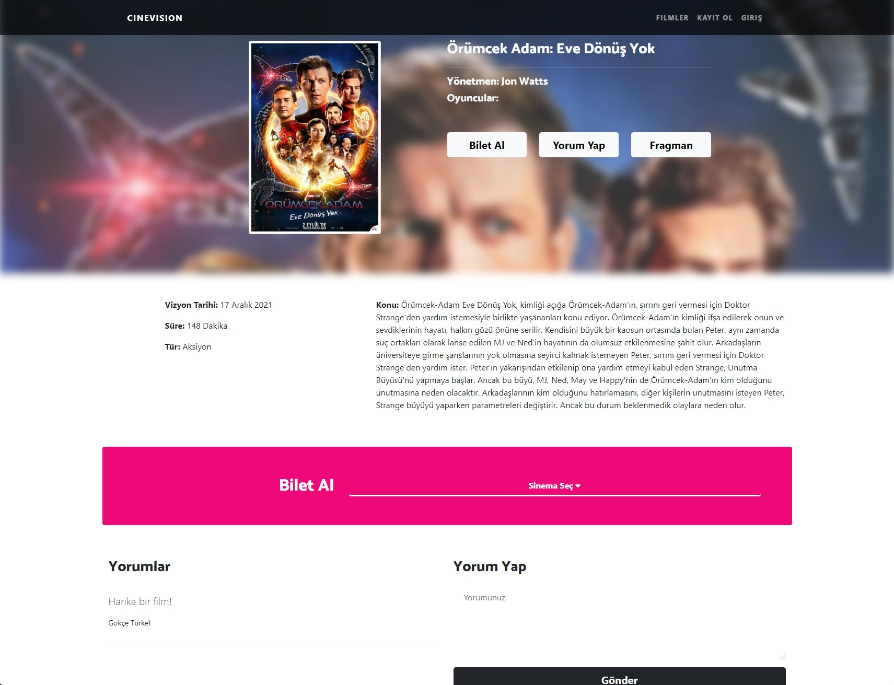
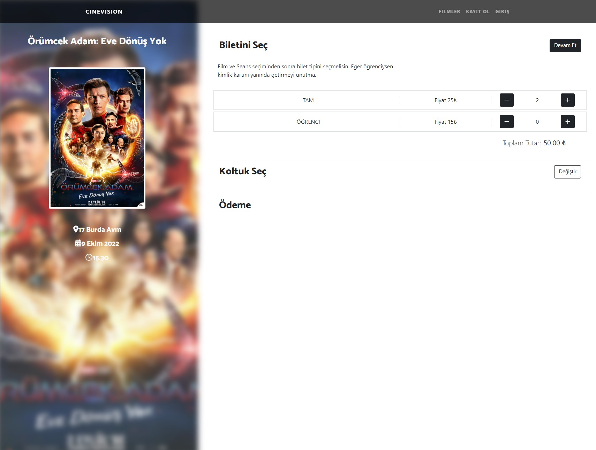
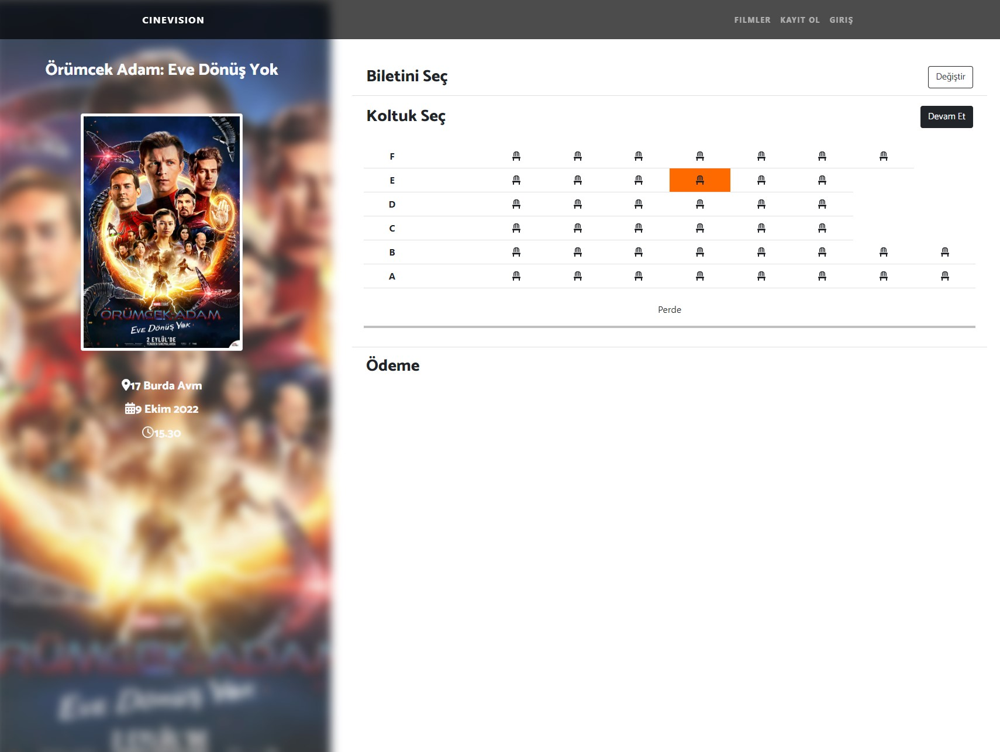
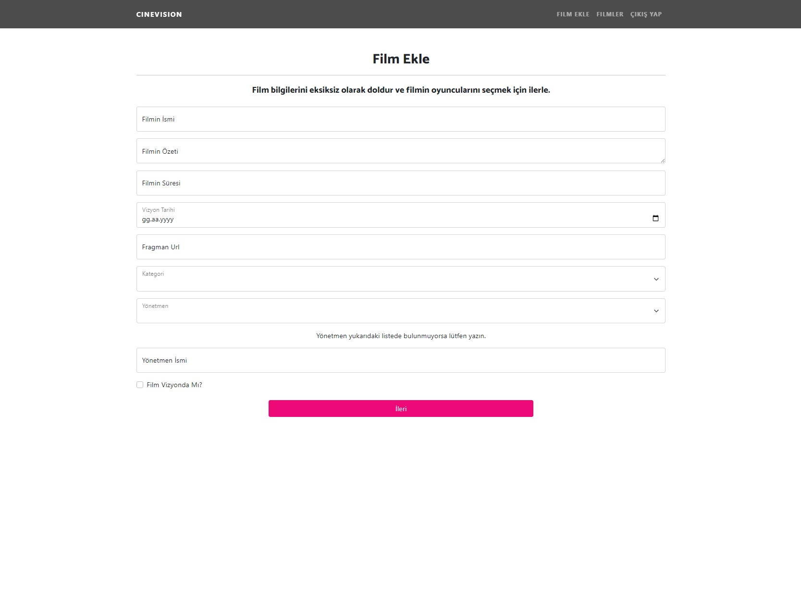
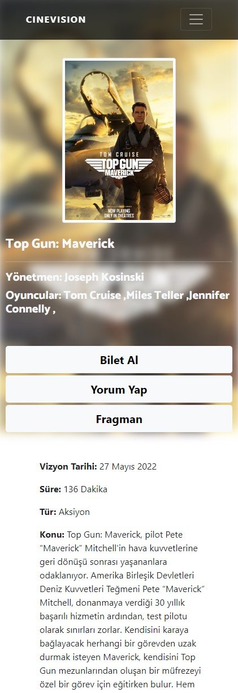
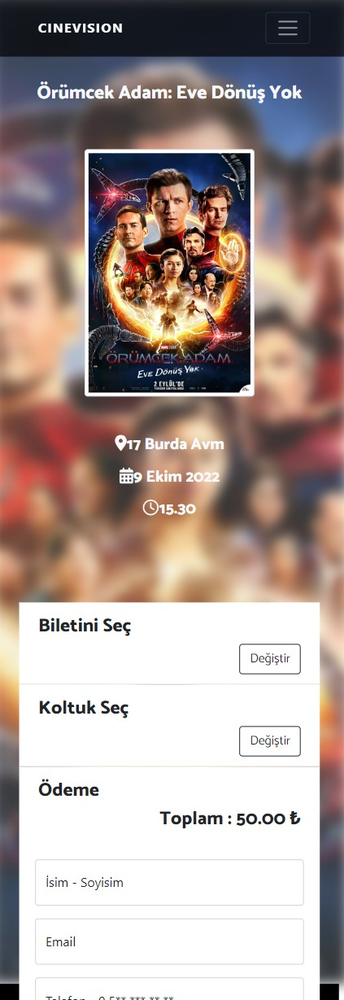

# CineVision Project's Frontend React App
This React project is the frontend codes of CineVisionMicroservice project.
The frontend codes for this project are written with JavaScript and React.
In this app, user can list movies in theaters. They can view movie details,
read reviews and write reviews about movies. They can choose city, cinema saloon and
seats in the saloon for buying ticket.

## Technologies
<ul>
    <li>React</li>
    <li>React Redux</li>
    <li>React Router Dom</li>
    <li>JavaScript</li>
    <li>Html</li>
    <li>Css</li>
    <li>Bootstrap</li>
    <li>Axios</li>
    <li>Toastify</li>
    <li>Formik</li>
</ul>

## Usage Of Technologies

Redux was used to store the movie and user information 
for which tickets are wanted to be purchased in the state. React Router
Dom was used to navigate between pages. To send request to rest api, 
Axios package was preferred. For showing toast message to users, Toastify 
was used. Formik was used to sending and validation forms. Project's UI design
was completed using Bootstrap and Css.

## Project's UI

<h3> <li>Main Page</li> </h3>
Movies in theater and upcoming movies is listed in th slider on this page.
Users go to movie detail by clicking the movie.

<h3> <li>Movie Detail</li> </h3>
Movie's plot, actors, director and other details in this page. Also, users can 
read and write comments in here. If people want to buy tickets,
they can choose a city and movie theater and go to the payment page.

<h3> <li>Payment </li> </h3>
People can choose their seats in the saloon and how many tickets they want to buy
in this page. After that they can purchase tickets with their credit card number,
email and name. 

<h3> <li>Admin Add Movie Panel </li> </h3>

Only admins can view this page because this page is protected by ProtectedRoute.
Whether the user is an admin is checked with the Jwt token.

<h3> <li>Responsive Design </li> </h3>

