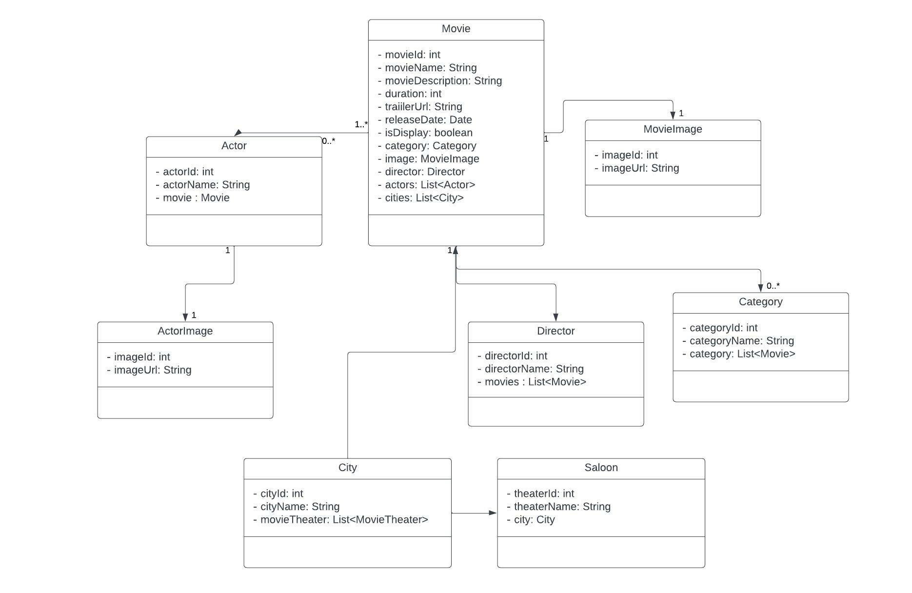

# Movie Service 
In this Movie Service includes all processes which are related 
to movies. Movies, actors, directors entities are stored in PostgreSql 
database. This Movie Service communicates with User and Email Services.
For Synchronous communication with User Service, it uses WebFlux.
And, Asynchronous communication with Email Service, it uses Apache Kafka.
This service is built using N-layered architecture. Directors, Movies, 
Actors, Cities was cached with Redis. 

## Techologies
<ul>
    <li>Spring Web</li>
    <li>Spring Data Jpa</li>
    <li>Netflix Eureka Client</li>
    <li>WebFlux</li>
    <li>Apache Kafka</li>
    <li>Resilience4j</li>
    <li>Zipkin</li>
    <li>Sleuth</li>
    <li>Redis</li>
    <li>PostgreSql</li>
</ul>

## Layers Of User Service
<ol>
    <h3><li>Entity</li></h3>
    

        Service entities which are represented database as table
        are here. Also, dto classes which are used for adding and
deleting entities are here.
    

<h3><li>Dao</li></h3>

Interfaces which are
necessary for accessing database are in this package.
Since we are using PostgreSql as database and Spring Data Jpa,
these interfaces extend the JpaRepository interface.

<h3><li>Config</li></h3>

For generating Kafka topic, KafkaTopicConfig configuration class
was created here. Also, WebClient.Builder bean was generated to 
communicate with User Service in this WebClientConfig configuration
class.

<h3><li>Controller</li></h3>

Controller classes which are annotated with @RestController tag
in this package. These classes generate api to access our service class from 
frontend. fallback methods which are used for CircuitBreaker is in these 
controller classes.

<h3><li>Kafka</li></h3>

KafkaProducer class is in this package. This class send message
to kafka topic which are created in KafkaTopicConfig class in Config
package.

<h3><li>Business</li></h3>

This package includes business logics of the service.
ActorServiceImpl, MovieServiceImpl, CityServiceImpl, CommentServiceImpl,
DirectorServiceImpl and MovieImageServiceImpl use WebFlux to communicate 
with User Service. They send request to User Service for verifying 
users authorization.

PaymentServiceImpl class's sendTicketDetail method generates email message
which includes ticket detail and send this message to Email Service
thanks to Kafka Producer.

</ol>

## UML Diagram Of Entities

    

