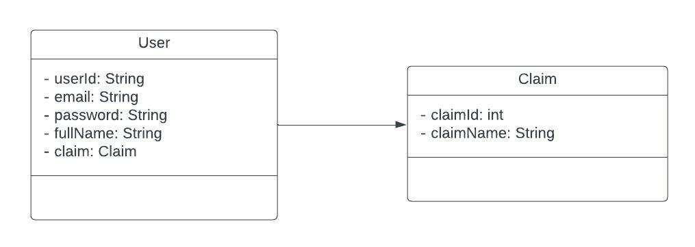

# User Service
User Service includes all user related processes.
The data of the users registered to the system are
stored in the MongoDB database located here. For securing
the service, Spring Security was used with Jwt. This service
is built using N-layered architecture.

## Techologies
<ul>
    <li>Spring Web</li>
    <li>Spring Security</li>
    <li>Jwt</li>
    <li>Netflix Eureka Client</li>
    <li>Zipkin</li>
    <li>Sleuth</li>
    <li>MongoDB</li>
</ul>

## Layers Of User Service
<ol>
    <h3><li>Entity</li></h3>
    

        There are 2 entities class in this package. Also,
        dto classes which are used for logging in, registering
        the system are here.
    

    
<h3><li>Dao</li></h3>
    

        In this package, there are 2 interfaces which are 
        necessary for accessing database.
        Since we are using MongoDB as database,
        these interfaces extend the MongoRepository interface.
    

<h3><li>Core</li></h3>
    

        SecurityConfig and PasswordConfig classes are in this package.
    SecurityConfig class includes security configurations and PasswordConfig
class includes BCryptPasswordEncoder bean configuration. In addition,
TokenVerifierFilter class is here for verifying the given token is valid or not.
JwtProviderService generates token with given authentication.
    

<h3><li>Controller</li></h3>
    

        AuthController includes login method. Users can login
the system using this controller method.
In the UserController class, addUser, isUserCustomer, isUserAdmin 
methods are in here. isUserAdmin and isUserCustomer methods invoke from
MovieService using WebFlux.
    

<h3><li>Business</li></h3>
    

        Business Package includes business logics of the service.
AuthServiceImpl class checks the given email and password. Then, If 
it is verified, the access token is generated.
    

    

        UsersDetailsServiceImpl implements UserDetailsService 
which comes from Spring Security. In this class's method loadByUsername method,
new User is generated with authorities.
    

    

        In UserServiceImpl class includes isUserCustomer and 
isUserAdmin methods. These methods get the token which send with request
and they decide whether the user is customer or admin. 
    

</ol>

## UML Diagram Of Entities

    

